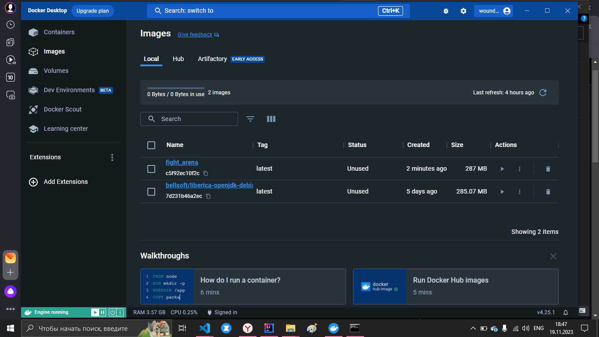
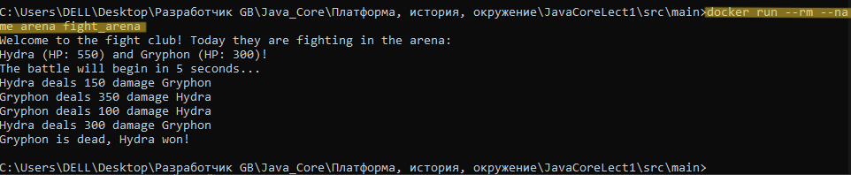

## Тимофеев Вадим 
### Группа: Веб-разработка на Java | Тех. специализация | 2

> `Java Core. Семинар 1 Домашнее задание`  

Установил Docker-desktop:


> dockerfile находится в src/main/

`Компилляция` файла:  
```bash
javac -sourcepath ./java -d out .\java\org\example\Main.java
```

`Запуск приложения:`
```bash
java -classpath ./out org.example.Main  
```

`Создать документацию:`  - основной файл index.html  
```bash
javadoc -encoding utf-8 -d docs -sourcepath java -cp out -subpackages org //из папки ./src/main  
```
**Ключи**:  
  * -encoding utf-8 - чтобы небыло абракадабры вместо кириллицы
  * -d docs //директория, куда необходимо сложить готовую документацию
  * -sourcepath java //исходники кода - тут комменты
  * -cp out (classpath) //где лежат готовые скомпиллированные классы
  * -subpackages //указание брать не только указанный основной пакет, но и все подпакеты рекурсивно
  * org //пакет, в котором нужно создавать документацию

`Создал образ:`  
```bash
docker build . -t fight_arena:latest
```

`Запустил контейнер на основе образа: ` 
```bash  
docker run --rm --name arena fight_arena  
```
  * -rm - удалить контейнер после того, как он отработает свой функционал
  * --name - именуем контейнер
  * fight_arena - образ


